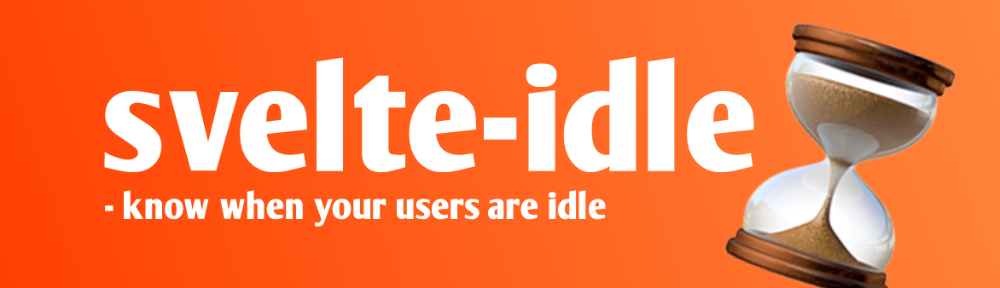

<p align="center">
    
</p>

<h2 align="center">
Features | <a href="https://svelte.dev/repl/005264a7de2446728aee059bb6fcbc46?version=3.46.4">Demo</a>
</h2>

<p align="center">
    No dependencies &mdash; TypeScript &mdash; SSR support &mdash; Readable store for idle value &mdash; <code>onIdle</code> callback
</p>

<h2 align="center">
Installation
</h2>

```bash
npm i svelte-idle
```

<h2 align="center">
Usage
</h2>

```svelte
<script>
import { start, idle, onIdle } from 'svelte-idle'

// Run start on component Initialization
start()

// Run code when user idle via callback...
onIdle(() => {
    console.log('User is idle')
})

//... or by using the idle store
$: {
    if($idle) console.log('User is idle')
}
</script>

User is idle: {$idle}
```

<h2 align="center">
API
</h2>

## start
The start method accepts an optional object (type: `StartOpts`). The following values can be defined:

### milliseconds
- type: `number`
- defines: how long before the user is udle

### throttle_milliseconds
- type: `number`
- defines: amount of milliseconds before each idle-check


#### Example:
```ts
import { start } from 'svelte-idle'

start({
    milliseconds: 60_000,
    throttle_milliseconds: 500
})
```

## idle
A readable store that reflects the current idle-state.

## onIdle
Callback which will be fired everytime idle becomes true. Returns a method for clearing the listener.

#### Example:
```ts
import { onMoumt } from 'svelte'
import { onIdle } from 'svelte-idle'

onMount(() => {
    const unsub = onIdle(() => console.log('User is idle!'))
    return unsub
})
```
